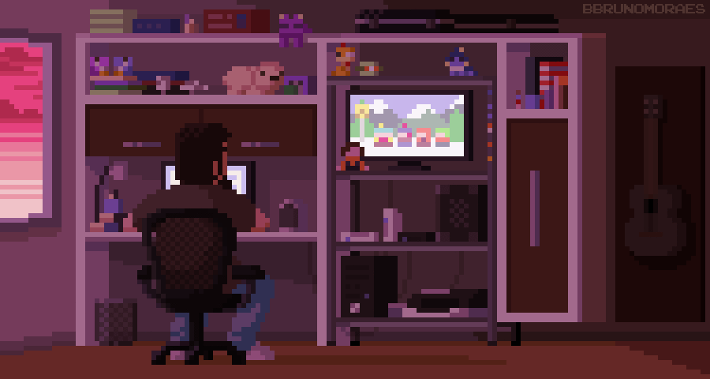

<div align="center" >

[](https://git.io/typing-svg)

</div>

<table align="center" border="0" cellspacing="0" cellpadding="0">
  <tr>
    <td style="border: 0;">
      
    </td>
    <td style="border: 0; vertical-align: top; padding-left: 20px;">

```js
export default function AboutMe(){
  return {
    name:"Tháinno Santana",
    nickname: "Tainu",
    age: 24,
    education: {
      major: "Software Engineering",
      university: "Unicesumar"
    },
    location: "Serra - ES Brasil"
  }
}

```
  </td>
  </tr>
</table>

<div align="center">
  <a href="https://github.com/Thainno">
    
    
  </a>
</div>

---

### 🛠️ Tools and Technologies:

<div>
  
  
  
  
  
  
  
  
  
  
</div>

---

### 📬 Contact me:

<div>
  <a href="https://www.instagram.com/thainno.santana/">
    
  </a>
  <a href="https://www.linkedin.com/in/thainno-santana/">
    
  </a>
  <a href="mailto:th&#97;innosv&#64;gm&#97;il.com">
    
  </a>
</div>

---

<picture>
  <source media="(prefers-color-scheme: dark)" srcset="https://raw.githubusercontent.com/Thainno/Thainno/output/pacman-contribution-graph-dark.svg">
  <source media="(prefers-color-scheme: light)" srcset="https://raw.githubusercontent.com/Thainno/Thainno/output/pacman-contribution-graph.svg">
  
</picture>


